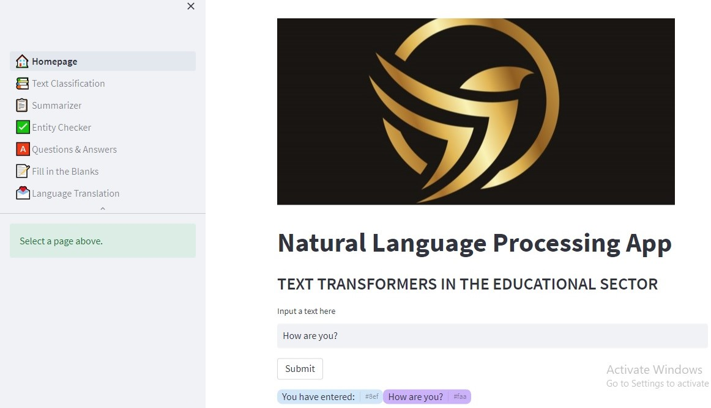
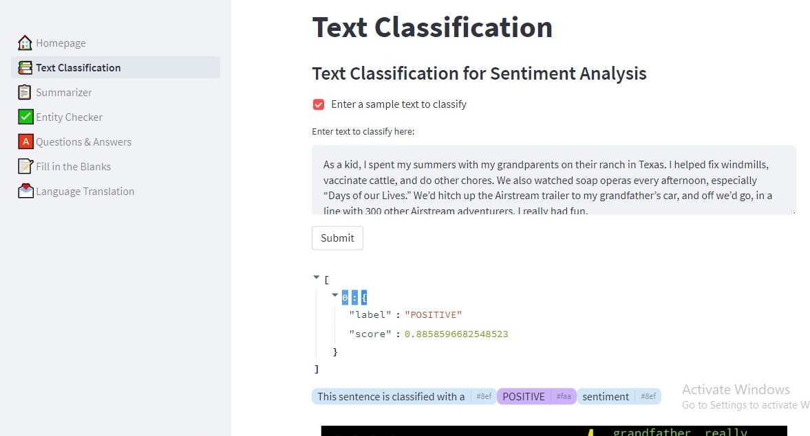
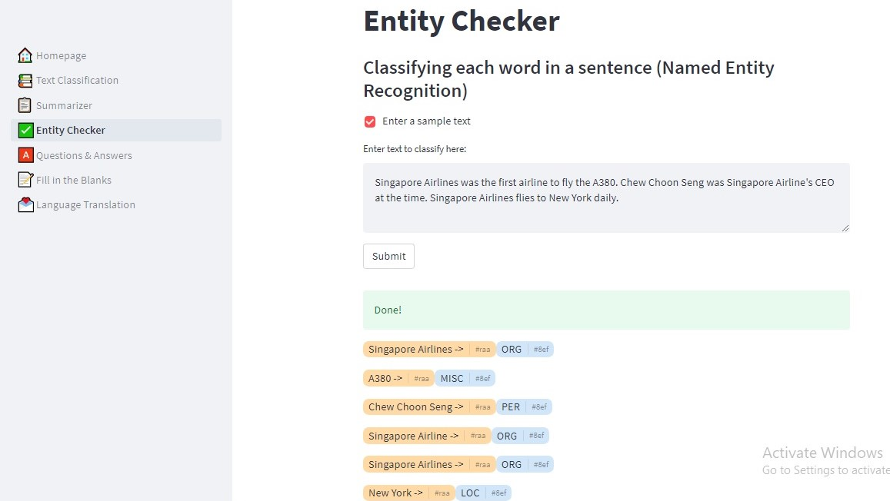
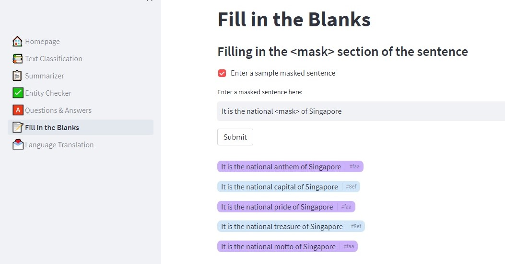
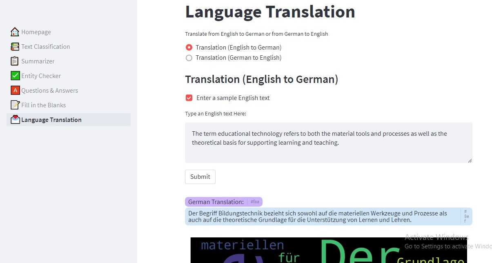
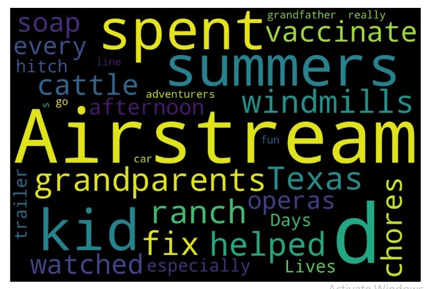

# NLP-Product
Application of Text Transformers in the Education Sector

# Data Science Product Development on Text Transformers in the Educational Sector
The NLP product developed using text transformers was tailored to meet the needs of educators and students in the educational sector. The product was designed to be easy to use, fast, accurate, and scalable.
- The application files can be downloaded from the link: https://drive.google.com/drive/folders/1UubOAJCB4Oa2j27EdUgDzWd5I6vGewgR?usp=sharing

### Description
The Data science NLP product was built with text transformers. There are suitable NLP machine learning models that are effective for use in the education sector. Some of them were used in developing the product.

The programming language that was used for developing the NLP product is Python. This is because Python is a versatile language that can be used for a wide range of tasks, from data processing and web development to scientific computing and machine learning. This flexibility makes it easy to integrate different aspects of a project into a cohesive whole.

In addition, Streamlit was used to design the user interface. This is due to its ease of deployment of machine learning applications onto the web. Streamlit enables developers to deploy their applications to a web server with only a few lines of code, making sharing their work easier. 
The Data exploration and machine learning was ran using Google Colab notebook. The models were saved in the local system and the streamlit application was built with .py scripts. The saved models was later used in the streamlit app for processing text and displaying the required results.

## Table of Contents

- [Dataset](#dataset)
- [Goals of Analysis](#goals-of-analysis)
- [Running Notebook](#running-notebook)
- [Running Application](#running-application)
- [Libraries](#libraries)
- [Use Cases](#use-cases)
- [Application Interfaces](#application-interfaces)
- [Credits](#credits)

## Dataset

Dataset used is the IMDb dataset. The Internet Movie Database contains movie reviews that were used to train text transformers on sentiment analysis. The dataset can be downloaded from the IMDb website: https://huggingface.co/datasets/imdb. The dataset was used to train  pre-train transformer models, “distilbert-base-cased” and “bert-base-cased” and any of the two models is to be used for sentiment analysis for text classification.

## Goals of Analysis
**The aim of the Analysis are as follows:**

- To explore the dataset in order to gain insights on the relationships between the feature variable - 'text' and the outcome variable - 'label' of the dataset and draw inferences.
- To investigate the size of the dataset to ascertain the amount of the dataset required and to decide the amount of data that should be dropped or be used for further analysis.
- Apply two major Supervised Machine Learning methods for transformers employed for Sentiment Analysis (“distilbert-base-cased” and “bert-base-cased”) on the selected dataset to give a clearer picture for predicting the sentiment of a text if is is POSITIVE or NEGATIVE.
- Use Confusion matrix and Accuracy scores to confirm the effectiveness of the models.
- Employ different Machine Learning Models used in NLP for displaying the outcome of various use cases popular among educational products.

## Running Notebook
**To run the Jupyter Notebook, follow the steps below.**
It is expected that python is already installed on your system (Minimum Python version is 3.6.6).
-  If you are interested in running the Jupyter notebook on your local system, you can follow the below steps otherwise upload the notebook files to Google Colab. **Installing Jupyter with pip. Open command prompt or terminal and type the following: 
`pip3 install --upgrade pip`; to ensure that you have the current version of pip;
`pip3 install jupyter`; to install Jupyter Notebook.**
- Clone or download the repository into your system.
- Navigate or cd into the folder containing the Jupyter notebook files 'notebook_files' in command prompt or terminal.
- Install the required libraries needed for the application if they are not already installed (See the 'libraries' section).
- Run the command: `jupyter notebook` or enter `python -m notebook` to open the notebook in the browser. Select the jupyter file to see the program and to start running the application 'CETM46_NLP_tasks_with_Transformers.ipynb', 'CETM46_text_classification_bert.ipynb' and 'CETM46_text_classification_distilbert.ipynb'. 

## Running Application
To run the application, you are expected to install all the required libraries first. The library names and their versions are located in the requirement.txt file or you can see them in the 'Libraries' section in this README file.
To run the application locally, follow the steps below:
- The application files can be downloaded from the link: https://drive.google.com/drive/folders/1UubOAJCB4Oa2j27EdUgDzWd5I6vGewgR?usp=sharing
- Open command prompt or terminal.
- Navigate or cd into the folder containing the streamlit application Homepage '1_🏠_Homepage' in command prompt or terminal. Notice the emoji in-between 1 and Homepage. It is used for displaying icons while the application is running. **Note: Navigate into the folder: 'streamlit_app'.**
- Install the required libraries needed for the application if they are not already installed (See the 'libraries' section).
- Run the command: `streamlit run 1_🏠_Homepage.py` or `python -m streamlit run 1_🏠_Homepage.py` from inside the 'streamlit_app' folder to start the application in the browser. **Note: To enter the homepage name in the command prompt or terminal, type 1 and then press the 'Tab' key on the keyboard to select the full name: '1_🏠_Homepage.py' automatically.**

## Libraries
**Install the following libraries from the command prompt/terminal if not already installed or directly from the jupyter notebook cells if you plan to run the Jupyter notebook:**
- `pip install pandas`
- `pip install matplotlib`
- `pip install sklearn`
- `pip install streamlit==1.11.0`
- `pip install sumy==0.11.0`
- `pip install spacy==3.5.1`
- `pip install bs4==0.0.1`
- `pip install wordcloud==1.8.2.2`
- `pip install transformers[sentencepiece]` 
- `pip spacy download en_core_web_sm`
- `pip install pytorch-pretrained-bert`
- `pip install st-annotated-text`
- `pip install streamlit-extras`
- `python -c "import nltk; nltk.download('punkt')"`
**Depending on your python version, you can include the command `python -m` or `py -m` in front of the above installation commands to get a compatible version of python that is suitable for the application.**

You can check the version of the module already installed by using the command: pip show [modulename].

## Use Cases
There are suitable educational product use cases that was employed in the product. Each of these categories was created after researching the impact of its outcomes on the educational system. The NLP use cases are: 
-	Classifying whole sentences 
-	Classifying each word in a sentence (Named Entity Recognition) 
-	Answering a question given a context 
-	Text summarization 
-	Fill in the blanks (Sentence completion) 
-	Translating from one language to another 

## Application Interfaces

1_🏠_Homepage

Figure 1

2_📚_Text_Classification

Figure 2

3_📋_Summarizer

Figure 3

4_✅_Entity_Checker

Figure 4

5_🅰️_Questions_&_Answers

Figure 5

6_📝_Fill_in_the_Blanks

Figure 6

7_💌_Language_Translation

Figure 7

8_🔠_WordCloud Display

Figure 8
## Credits

This Project was created by Okeoma Ihunwo
